# StdToolheadOpenfoam

Standardised CFD workflow for 3d printer toolhead analysis based on Openfoam.com
  This repository aims to provide a standardised methodolodgy for CFD analysis.
 The workflow follows the process outlined below:
1) Geometry preparation
2) Fluid domain generation
3) Boundary condition calculation
4) Mesh configuration
5) Case configuration including any additional parameter processing
6) Case execution and monitoring
7) Post-processing

The workflow uses software freely avaliable for non-commercial use:
* Fusion 360 - CAD and Geometry Preparation (steps 1 & 2)
* Excel - Boundary condition calcs (step 3) - Ok so not free but readliy avaliable, can be migrated to python at some point   
* VSCode - All interfaceing with Openfoam setup and execution as well as launching paraFoam/paraView for post-processing - (Steps 4-7)
* OpenFOAM v2306 - Openfoam.com flavour (largely the same as .org but syntax varies) (steps 4-6)
* ParaFOAM - Post-processor bundled into OpenFOAM, could also use ParaView either in Linux or Windows (step 7)

## Folder Structure
This workflow assuems a common folder structure:
 	`./<CaseName>/01_Geometry`
  	`./<CaseName>/02_Run`
 	`./<CaseName>/03_Calcs`
  **Note** that the pre-run cleanup script will update the mesh geometry based on the contence of `./<CaseName>/01_Geometry` 

## OpenFOAM versions

The scripts are developed for running on v2306 of [OpenFOAM.com](https://develop.openfoam.com/Development/openfoam/-/wikis/precompiled)
The [Windows 10 installation guide](https://www.openfoam.com/download/openfoam-installation-on-windows-10) on the OpenFOAM website will install v2012. In order to install v2306 please use the following guide:
[https://develop.openfoam.com/Development/openfoam/-/wikis/precompiled/windows](https://develop.openfoam.com/Development/openfoam/-/wikis/precompiled/windows)
If you choose v2012 use the [./0.org/p_v2012](./02_Run/0.org/p_v2012) pressure boundary condition. **Note:** The file will need to be renamed to `p`

## CFD basics

Keeping this very brief as there are numerous far better guides that I could give, however this is aimed at providing the key points to enable a user to generate a CFD model, not understand it fully. 
A simulation is based on a domain, this is the volume you are modelling the fluid flow in (in our case, the fluid is air). 
The domain will have 3 classes of boundaries:  
1) Walls - no fluid passes through these
2) Inlets - Regions where fluid comes into the domain
3) Outlet - Regions where fluid exits the domain

In this workflow, the inlets are fan outlets. They are modelled as a uniform velocity based on a fan flow function curve (pressure drop relative to volumetric flow rate) 
The outlet is the atmosphere. We don't specify any velocity here, just that flow can exit through these planes, the simulation will do the work to predict how and where. 
The simulation is run incompressible. This is due to the mach numbers generally being low (<0.3). If you are trying to predict something like berd air or a very high pressure inlet, it's possible that this may not be valid. 

The model is run transiently. This can be important and is not possible in simscale with a free licence. Essentially the simulation will run from the starting of the cooling fans through to a fully developed flow. By running transiently it is possible to detect aerodynamic instablities. When a simulation is run steady-state these can lead to poor convergence and non-physical results. This does increase the run time, however optimistion of the goemetry and meshing still allow for a relatively fast solution, converging within a couple of hours, although exact times vary significantly depending on CPU, and to a less extent, RAM performance.

## Step 1: Geometry Preparation

Geometry preparation is critical to high quality meshes and convergence. The geometry will also directly impact the mesh size and hence solution time. 
The following is given as an example of the preparation and which can then be used on your own geometry. [https://a360.co/3PRtX5L](https://a360.co/3PRtX5L) 
The initial steps are as follows:
1) Start with the basic arragement of the geometry and add part geometry to simulate more realistic restictions about the nozzle.
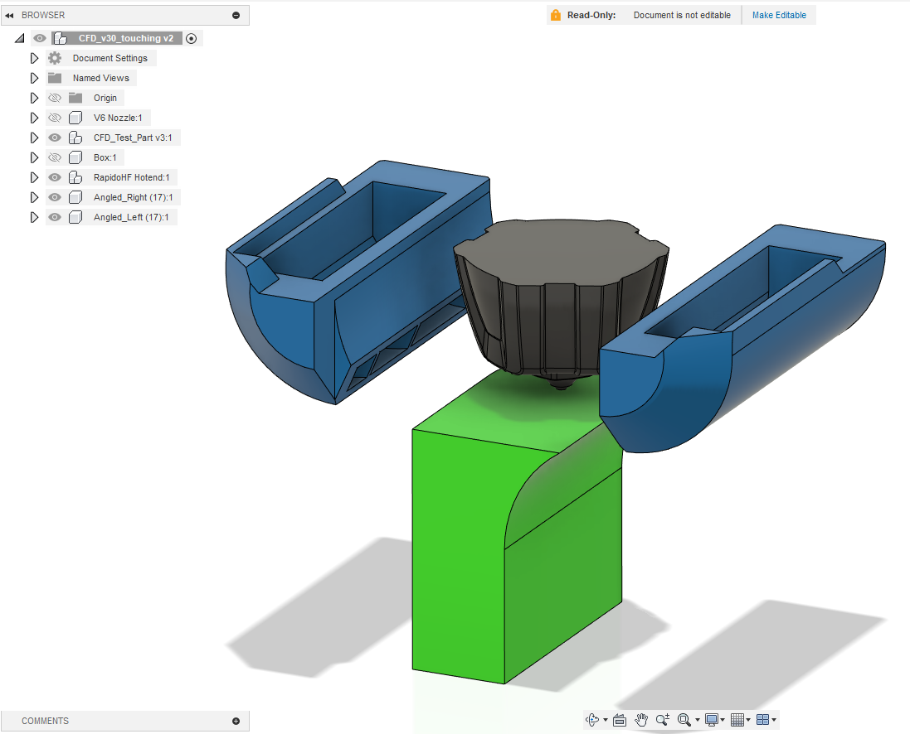
2) Simplify the duct and nozzle gometry. Removing small faces and insiginicant features will significantly reduce the mesh size and in turn, the simulation run-time.
3) Define the fluid domain - Basically work out how much you want to model. Take a note of the min/max x,y,z coords for this domain.
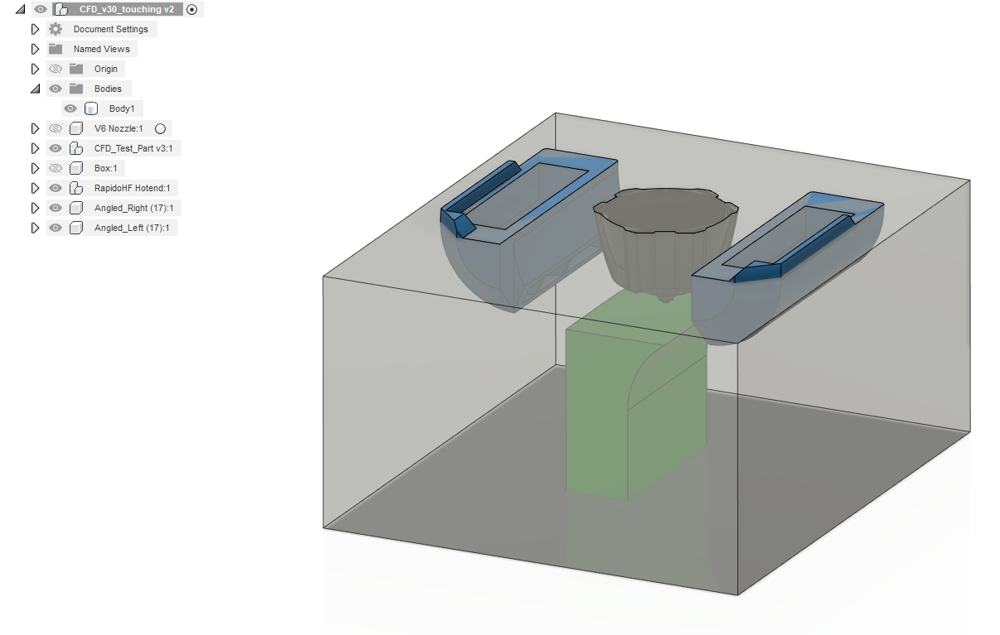
4) Substract the gometry from the fluid domain
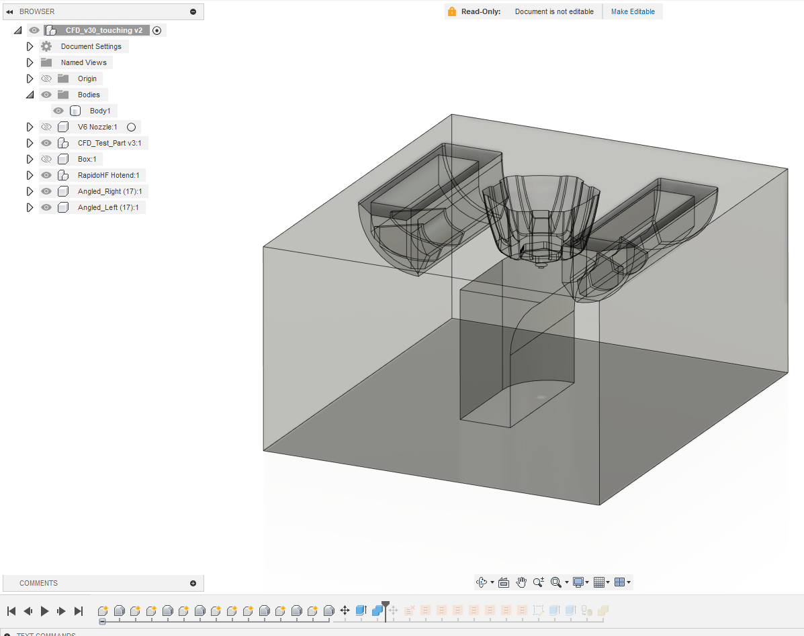
6) Position the geometry with the origin (0,0,0) at the nozzle tip
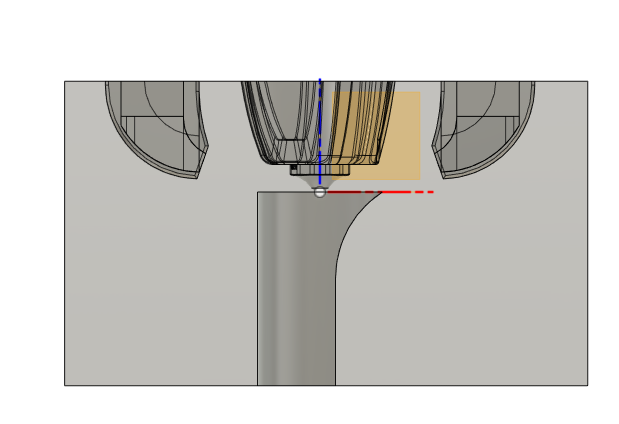
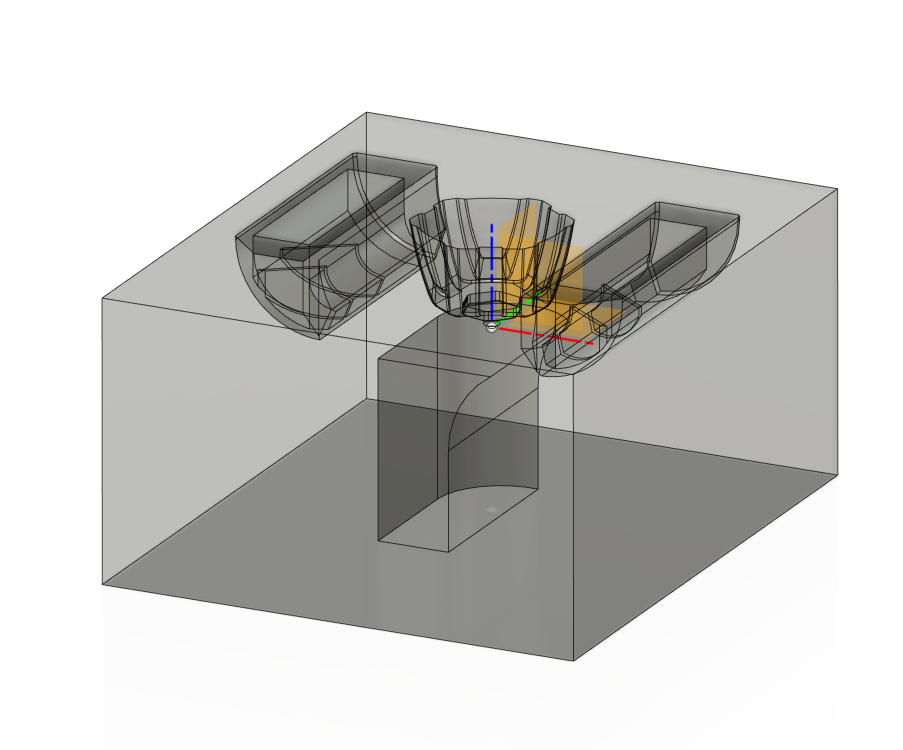
7) Un-stitch the domain and re-stitch faces based on the regions defined in step 2.
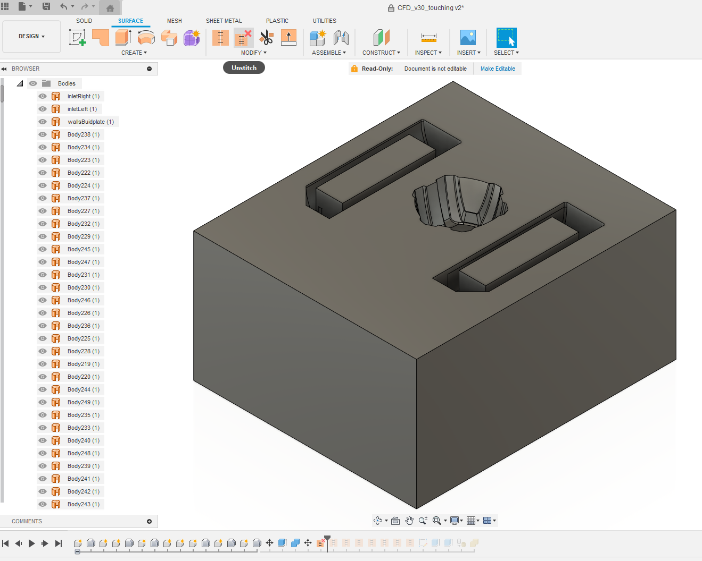
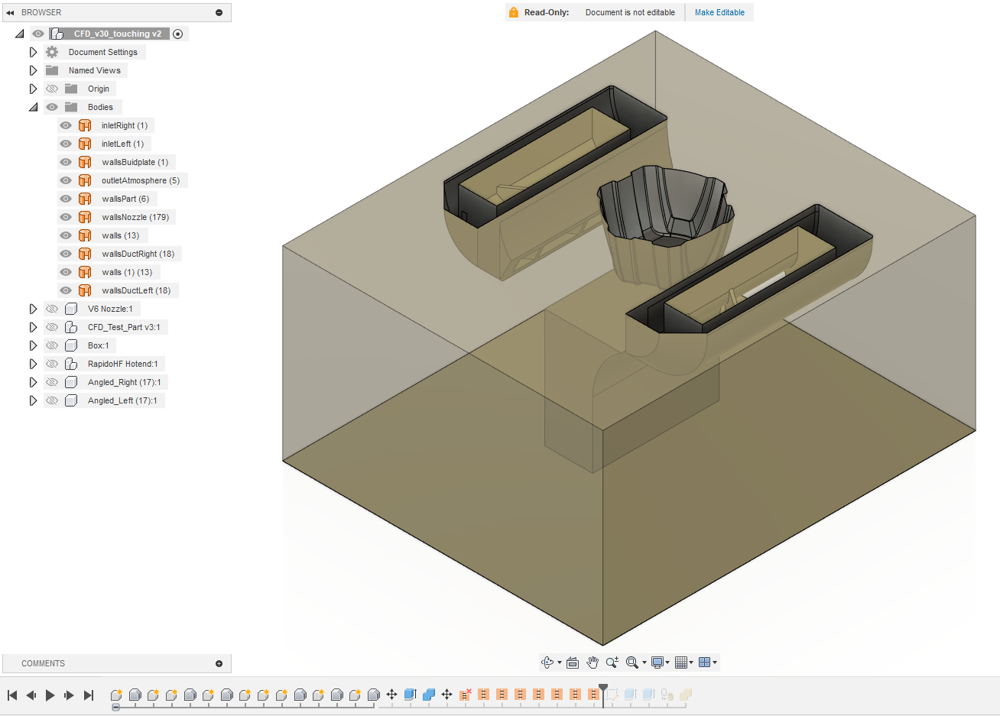
8) Generate solid bodies for the refinement zones about the part and nozzle.
   Nozzle refinement:
  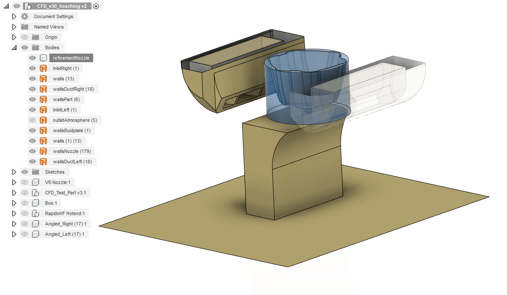
   Part refinement:
  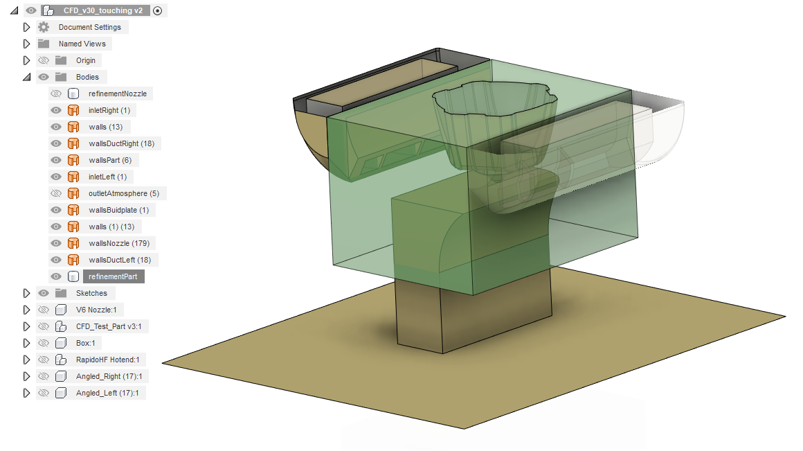
10) Convert grouped faces to mesh
11) Combine mesh's as required (ie. left and right duct outer walls into 'walls')
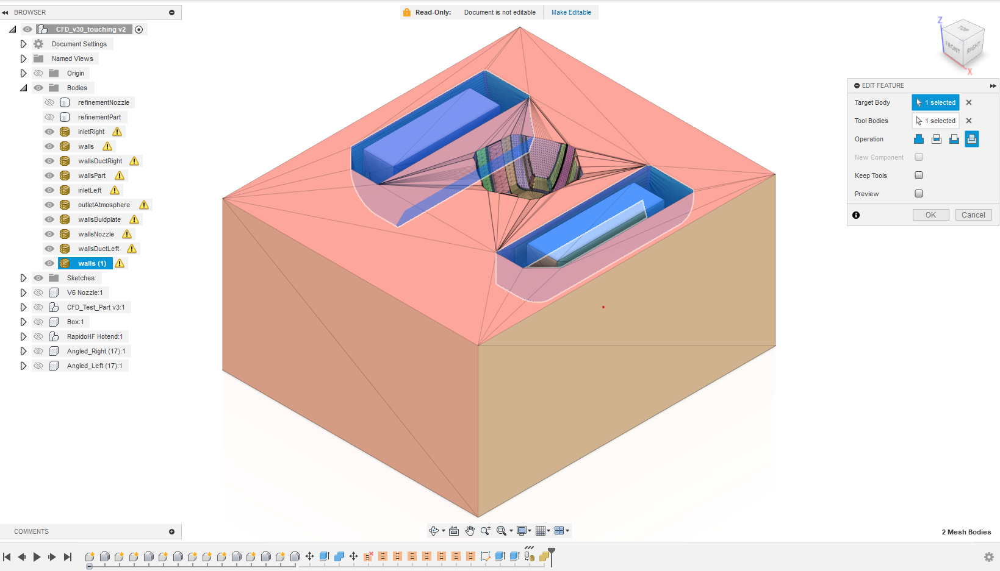
12) Export all mesh and solid bodies as stl's (in _**meters**_)
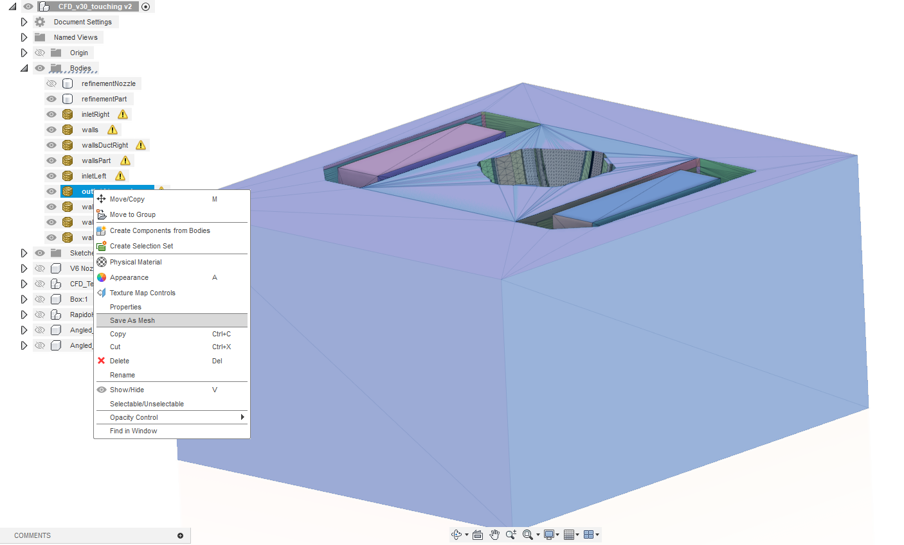
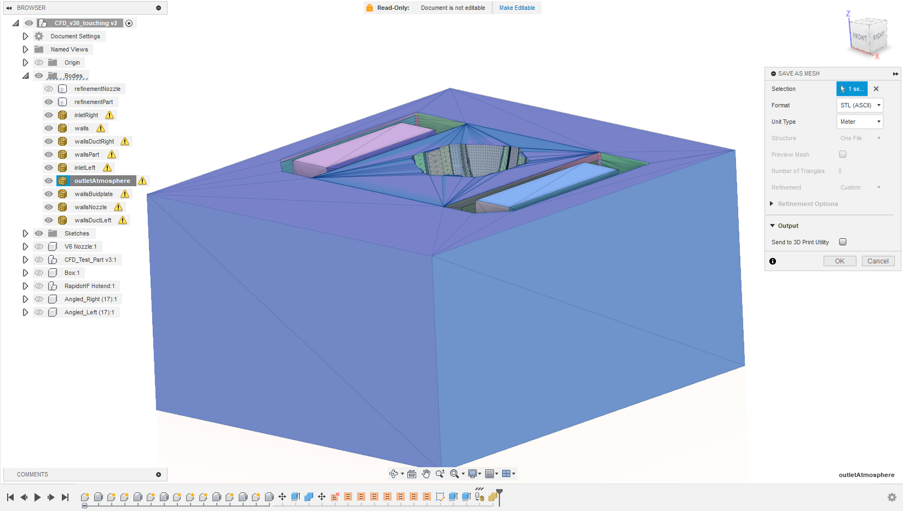
13) Save all stl's in <code>./01_Geometry/</code>

## Step 2: Fluid Domain Generation

The fluid domain is generated using stl's containing the surfaces which make up a given <code>patch</code>
 A patch is used to define boundary conditions, such as a domain inlet, outlet or a wall.
 Walls are sub-divided to enable mesh refinement in given regions, hence multiple stl's are required for the walls
 Volumetric regions are also used for mesh refinement, specifically fine refinment around the nozzle and moderate refinement around the part.

The following stl's are required for the meshing to work without modification: 

### Inlet

- inletLeft
- inletRight

### Outlet

- outletAtmosphere

### Walls

- walls
- wallsDuctLeft
- wallsDuctRight
- wallsNozzle
- wallsBuildplate
- wallsPart

### Refinement Regions

- refinementNozzle
- refinementPart
  Further details to be added...

## Step 3: Boundary Condition Calculation

Template file includes suitable bounadry conditions to simulate a 4010 GDSTime blower into ambient air
 The Case is run isothermal incompressible with k-Omega SST turbulence model.
  Supporting workbook to be added... 

### Runtime considerations

This CFD is configured to run transiently. This ensures the CFD analysis is robust when solving unsteady flowfields (frequently caused by modelling opposing jets of air from the ducts) case is run transiently. It also allows the use of a fan pressure curve to determine the expected jet velocities for a given duct design.
  A transient analysis runs using time steps. The flowfield is re-calculated for each time step, in this case it's simulating the fan startup through to steady state operation.
  The analysis needs to be run sufficiently long that the flow has developed over the nozzle and stabilised. Testing has shown this is ~0.016s. The anlaysis is configured to run for 0.02s to give some headroom.
  The duration of a time step is set by the time taken for flow to pass through a cell within the simulation. Therefore a very fine mesh or a very high speed flow will lead to small time step being required and a longer run time. If the velocity is increased (ie more powerful fan is modelled) then the time required to reach a steady state condition is expected to reduce, however this should be monitored during the run using ParaFOAM to ensure the solution has reached a steady state condition.
  Before running very high velocity flows the user should consider whether it's required. If the flowfield is unchanged (likely to be the case for the low Mach numbers typically running), hand calculations are likely to be sufficient to estimate the velocity. 

## Step 4: Mesh Configuration

Meshing is completed in a number of steps.
1) blockMesh is generated for the fluid domain. This is the background mesh and will be refined.
2) The mesh is decomposed based on the number of processors solving the analysis
3) The geometry is processed to extract edges of the stl's
4) SnappyHexMesh refines the mesh around the geometry and refinement regions, generating the final analysis mesh
  The case is configured to run in parallel using openMPI on 16 processors.
 The variable numProc has been set in [decomposParDict](./02_Run/system/decomposeParDict) file.
 Running on a couple few cores than the PC has enables post-processing during a run (assuming there is sufficient system RAM)
 The meshing has been configured with the following:
* stl's should be saved in meters
* stl's should be stored in `./<CaseName>/01_Geometry`
  When the fluid domain is modified the min/max coordinates must be updated in [blockMeshDict](./02_Run/system/blockMeshDict)
 The blockMesh domain should be larger than the fluid domain, therefore any values should be rounded up to the nearest 0.1mm
 eg. if the minimum corner point is (-60, -30, -25), the blockMeshDict should be updated to (-60.1, -30.1, -25.1)
 Issues with the blockMesh domain will result in a `world` patch being created and errors associates with boundary conditions not being provided during the decomposition of the mesh.

### Mesh refinement

Mesh refinement is used to decrease the element size generated by the blockMesh. The case has been configured to use 2 approaches for this, surface refinement and volumetric refinement.
  The refinement is applied in regions of higher velocity, stong interaction between jets or regions of interest where details in the geometry may impact the results.
  Refinement is defined based on the level of reduction in the region relative to the blockMesh size, with each level halving the element size. More details can be found in the [OpenFOAM guide](https://www.openfoam.com/documentation/guides/latest/doc/guide-meshing-snappyhexmesh).

#### Surface refinement

The focus of the wall refinement is in the ducts and nozzle, with the nozzle being more refined than the ducts
  The part and build plate have a level of refinement to ensure the geometry is well resolved, however the velocities slow significantly by this region and therefore significant refinement is not required.

#### Volumetric refinement

Volumetric refinement is used to capture the region of interaction between the opposing jets, as well as an additional highly resolved region between the part and the nozzle. Gaps require ~8 elements to properly resolve flow, however the low level of flow coupled with the resultant very small elements will significantly increase both run time and mesh size (ram requirements) and is not expected to significantly alter understanding.
  The simpliest way to add volumetric refinement is through generation of a volume in CAD and export as an STL, as has been done for the part and nozzle refinement regions. The local region around the tip of the nozzle has been added as a cylinder within [snappyHexMeshDict](./Run_02/system/snappyHexMeshDict), and is reliant on the mesh being datumed such that the tip of the nozzle is at (0, 0, 0).

## Step 5: Case Configuration
To be added... 

## Step 6: Case Execution

Before running the case ensure the number of processors in the run scripts are set according to [decomposParDict](./02_Run/system/decomposeParDict) 
  The following files need to be checked and updated as required:
- [miniMesh](./miniMesh)
- [allRun](./allRun)
- [newBCs.sh](./newBCs.sh)

The `mpirun` commands should be configured to ensure the number of processors `-np` is correct.
 For example, 16 processors are requested for the following command in [allRun](./allRun) 
 `mpirun -np 16 --use-hwthread-cpus renumberMesh -overwrite -parallel`

  
Hyper Threading

The argument <code>--use-hwthread-cpus</code> enables hyper treads to be treated as cores. Typically simulation software runs slower using hyper threading, therefore should be disabled. Trials with this workflow havn't shown a significant impact and since it's expected the user will have a general use PC rather than a workstation, the mpi commands have been structed to use hyper threaded cores.

Open the <code>02_Run</code> folder in VSCode
 Open a terminal
 Run <code>sh allMesh</code>
 This will complete a folder clean up to remove any previous meshes, then generate a mesh, decompose for the number of processors and then run the boundary condition initialisation followed by pimpleFoam solver.
 <bold>Note</bold> The cleanup script removed the geometry from the 02_Run folder and updates it from the 01_Geometry folder. This enables automated updating of the geometry but means the workflow will not run without the  

## Step 7: Post-processing

